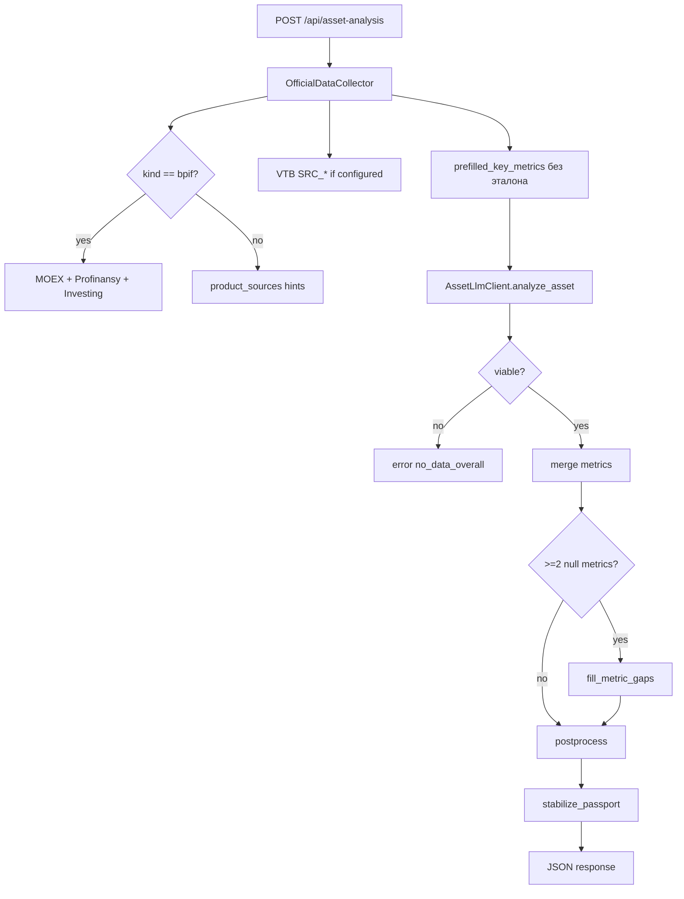

# VTB MVP — полное описание проекта

MVP инвестиционного консulting-интерфейса ВТБ: **диалоговое окно** (бэктест и сценарии портфеля) и **«Анти-Гугл»** (математический паспорт продукта). Backend — Python/FastAPI, frontend — один статический HTML.

---

## Содержание

1. [Обзор и цели](#1-обзор-и-цели)
2. [Архитектура](#2-архитектура)
3. [Структура репозитория](#3-структура-репозитория)
4. [Запуск и конфигурация](#4-запуск-и-конфигурация)
5. [API](#5-api)
6. [Модуль «Диалоговое окно»](#6-модуль-диалоговое-окно)
7. [Модуль «Анти-Гугл» (asset-analysis)](#7-модуль-анти-гугл-asset-analysis)
8. [Вселенная продуктов](#8-вселенная-продуктов)
9. [Ключевые метрики по типам](#9-ключевые-метрики-по-типам)
10. [Источники данных](#10-источники-данных)
11. [LLM: промпт, ограничения, таймауты](#11-llm-промпт-ограничения-таймауты)
12. [Постобработка и стабильность ответов](#12-постобработка-и-стабильность-ответов)
13. [Frontend](#13-frontend)
14. [Коды ошибок](#14-коды-ошибок)
15. [Что на заглушках vs production-ready](#15-что-на-заглушках-vs-production-ready)
16. [Типичные проблемы и настройка](#16-типичные-проблемы-и-настройка)

---

## 1. Обзор и цели

| Блок | Назначение | Реализация |
|------|------------|------------|
| **Диалог** | NLU → бэктест / сценарий / уточнения | Заглушка модели ВТБ (`VtbModelClient`) |
| **Генерация портфеля** | 5 вариантов предложенного портфеля | Заглушка из `products.py` |
| **Анти-Гугл** | Краткий «паспорт» продукта: резюме, факторы, 5 метрик, источники | Парсеры + LLM (Perplexity/aitunnel) |

Продуктовая вселенная — **30+ позиций** ВТБ (БПИФ, ОПИФ, ЗПИФ, вклады, счета, ИСЖ/НСЖ, драгметаллы, Интеллект, ПДС и др.), единый каталог в `core/products.py`.

---

## 2. Архитектура

```
┌─────────────────────────────────────────────────────────────────┐
│  frontend/src/index.html                                        │
│  • Чат (POST /api/chat)                                         │
│  • Анти-Гугл (POST /api/asset-analysis)                         │
│  • Chart.js для графиков бэктеста/сценария                      │
└────────────────────────────┬────────────────────────────────────┘
                             │ HTTP
┌────────────────────────────▼────────────────────────────────────┐
│  python_backend/main.py  →  core/api.py                         │
├─────────────────────────────────────────────────────────────────┤
│  DialogService          │  AssetService                          │
│  + VtbModelClient       │  + AssetLlmClient                      │
│  + nlu.py               │  + OfficialDataCollector               │
└─────────────────────────┴───────────────────────────────────────┘
                             │
         ┌───────────────────┼───────────────────┐
         ▼                   ▼                   ▼
   MOEX / Profinansy    VTB API (env)      LLM (sonar / deep-research)
   Investing (ссылка)   product_sources    aitunnel / Perplexity
```

**Принцип Анти-Гугла:** сначала детерминированный сбор с известных URL/API, затем LLM дополняет пробелы, затем серверная постобработка (сжатие текста, фильтр метрик, стабилизация).

---

## 3. Структура репозитория

```
app/
├── PROJECT.md                 ← этот документ
├── README.md                  ← краткий quick start (может отставать)
├── .env / .env.example        ← секреты и таймауты
├── requirements.txt
├── python_backend/
│   ├── main.py                ← FastAPI app, static mount
│   └── core/
│       ├── api.py             ← маршруты /api/*
│       ├── models.py          ← Pydantic: ChatRequest, AssetRequest, SessionContext
│       ├── config.py          ← required_env, llm_timeout_sec
│       ├── clients.py         ← ExternalApiClient, VtbModelClient (заглушки)
│       ├── services.py        ← DialogService
│       ├── nlu.py             ← intent, period, scenario, portfolio
│       ├── products.py        ← PRODUCT_UNIVERSE, портфели, сценарии, тикеры
│       ├── product_metrics.py ← схемы 5 метрик по kind
│       ├── product_reference.py ← эталонные тексты/метрики (стабильные категории)
│       ├── product_sources.py ← URL и search_queries для LLM
│       ├── asset_service.py   ← оркестрация Анти-Гугла
│       ├── asset_llm.py       ← промпт и вызов LLM + gap-fill
│       ├── asset_text.py      ← sanitize_factors, strip [N]
│       ├── asset_stabilizer.py← слияние official / LLM / эталон
│       ├── metric_format.py   ← нормализация %, liquidity
│       ├── metric_values.py   ← is_concrete_metric (цифра vs «по условиям»)
│       └── official_sources/
│           ├── collector.py   ← оркестрация парсеров
│           ├── moex.py
│           ├── profinansy.py
│           ├── investing.py
│           └── vtb.py         ← SRC_* из env
└── frontend/
    └── src/
        └── index.html         ← весь UI
```

---

## 4. Запуск и конфигурация

### Установка

```bash
cd app
python3 -m venv .venv
source .venv/bin/activate   # Windows: .venv\Scripts\activate
pip install -r requirements.txt
cp .env.example .env
# заполнить LLM_API_KEY и др.
```

### Запуск

Из каталога `app/`:

```bash
uvicorn python_backend.main:app --host 0.0.0.0 --port 3000
```

UI: http://localhost:3000

### Переменные окружения

| Переменная | Назначение | Пример |
|------------|------------|--------|
| `PORT` | Порт (информативно) | `3000` |
| `HTTP_TIMEOUT_SEC` | Таймаут парсеров (MOEX, profinansy) | `15` |
| `LLM_TIMEOUT_SEC` | Таймаут запроса к LLM | `300`–`900` для `sonar-deep-research` |
| `LLM_PROVIDER` | `perplexity` или `aitunnel` | `aitunnel` |
| `LLM_BASE_URL` | Base URL API | `https://api.aitunnel.ru/v1` |
| `LLM_API_KEY` | Ключ | `sk-...` |
| `LLM_MODEL` | Модель | `sonar`, `sonar-deep-research` |
| `LLM_GAP_MODEL` | Модель для дозаполнения метрик (опц.) | `sonar` |
| `LLM_ENDPOINT` | Обычно `/chat/completions` | |
| `LLM_TEMPERATURE` | Рекомендуется `0` | `0` |
| `LLM_SEED` | Seed для воспроизводимости (если поддерживается) | `42` |
| `SRC_INSTRUMENT_CARD_URL` | API карточки инструмента ВТБ | |
| `SRC_VTB_RESEARCH_URL` | API аналитики ВТБ | |
| `SRC_FIN_REPORTS_URL` | API отчётности | |
| `SOURCES_API_TOKEN` | Bearer для SRC_* | |

Проверка конфига:

```bash
curl -sS http://localhost:3000/api/config-check
```

---

## 5. API

### `GET /api/health`

Healthcheck: `{"ok": true, "at": "..."}`.

### `GET /api/products/universe`

Список всех продуктов: `productId`, `productName`, `kind`, `category`.

### `GET /api/products/metrics-schema?kind=bpif`

Схема 5 метрик для типа: `metrics` (key/label/hint), `labels`.

### `GET /api/config-check`

Статус LLM env и провайдера.

### `POST /api/chat`

```json
{ "sessionId": "s1", "message": "покажи бэктест текущего портфеля за 3 года" }
```

Ответ: `success`, `intent` (`BACKTEST` | `SCENARIO` | `UNKNOWN`), `reply`, опционально `data` (графики), `actions`, `context` (сессия).

### `POST /api/portfolio/generate`

```json
{ "sessionId": "s1", "variant": 1 }
```

Заглушка: один из 5 предложенных портфелей из вселенной продуктов.

### `POST /api/asset-analysis` — Анти-Гугл

```json
{
  "asset_id": "БПИФ «Золото.Биржевой»",
  "asset_type": "bpif",
  "user_id": "current",
  "period_days": 30
}
```

- `asset_id` — **точное `productName`** из каталога (так шлёт frontend).
- `asset_type` — `kind`: `bpif`, `opif`, `zpif`, `iszh`, `nszh`, `deposit`, `account`, `precious_metal`, …

**Успех (`success: true`):**

```json
{
  "success": true,
  "data": {
    "asset_name": "...",
    "ticker": "...",
    "asset_type": "bpif",
    "summary": "≤130 символов",
    "positive_factors": ["...", "...", "..."],
    "negative_factors": ["...", "...", "..."],
    "key_metrics": { "...": "..." },
    "key_metrics_labels": { "...": "..." },
    "sources": [{ "title", "url", "type", "updatedAt" }],
    "data_sources_coverage": {
      "moex", "profinansy", "investing", "vtb_card", "vtb_research"
    },
    "updated_at": "ISO8601",
    "disclaimer": "..."
  }
}
```

---

## 6. Модуль «Диалоговое окно»

### NLU (`core/nlu.py`)

| Функция | Что делает |
|---------|------------|
| `detect_intent` | BACKTEST / SCENARIO / UNKNOWN |
| `extract_period_years` | «за 3 года» → `3` |
| `detect_scenario_type` | rate_hike, market_drop, currency_shock |
| `extract_scenario_value` | «на 30%», «до 25%» |
| `extract_portfolio` | current / proposed |

### Сессия (`SessionContext`)

Хранится in-memory по `sessionId`: последний intent, портфель, годы бэктеста, сценарий, история (5 сообщений), `proposed_portfolio`.

### Заглушка ВТБ (`VtbModelClient`)

- **`backtest`** — 8 точек, метрики доходности/просадки/Sharpe, сравнение с IMOEX.
- **`scenario`** — impact по типу сценария и величине; winners/losers из `SCENARIO_CONFIGS`.
- **`generate_portfolio`** — 5 заранее описанных портфелей.
- **`get_current_portfolio`** — тестовый портфель 2,5 млн ₽.

Ограничение: бэктest proposed на 5+ лет → `insufficient_data`.

---

## 7. Модуль «Анти-Гугл» (asset-analysis)

### Пайплайн (пошагово)

```
1. OfficialDataCollector.collect(asset_id, asset_type)
      → metrics (только парсеры/API, без эталона)
      → sources, context_lines, search_queries, coverage

2. AssetLlmClient.analyze_asset(..., official_ctx)
      official_ctx:
        • prefilled_key_metrics
        • context_text, search_queries, recommended_sources
        • stable_profile (эталон summary/фactors)
        • coverage, source_errors

3. Проверка viable — есть summary/факторы/метрики/источники или эталонный summary

4. merge_key_metrics: official → LLM (только null)

5. Gap-fill (если ≥2 пустых «конкретных» метрик):
      AssetLlmClient.fill_metric_gaps(...)

6. Постобработка:
      • strip [1][5], сжатие summary/factors
      • sanitize_factors — без %, СЧА, TER в факторах
      • stabilize_passport — этalon для стабильных kind

7. Ответ JSON
```

### Формат паспорта (ограничения UI)

| Поле | Лимит |
|------|-------|
| `summary` | 1–2 предложения, **≤130 символов** |
| `positive_factors` / `negative_factors` | **ровно до 3** пунктов, **≤100 символов** каждый |
| `key_metrics` | **ровно 5** полей по схеме `kind` |
| `sources` | топ-**3** в UI |

### Разделение факторов и метрик

- В **key_metrics** — все цифры (% , СЧА, TER, ставки…).
- В **positive/negative** — только качественные драйверы/риски; `asset_text.sanitize_factors` вырезает числа и слова «доходность», «СЧА», «TER» и т.п.

---

## 8. Вселенная продуктов

Источник истины: `PRODUCT_UNIVERSE` в `core/products.py`.

**Категории (`kind`):**

- `bpif` — 5 БПИФ (GOLD, LQDT, TMOS, SBMX, ESG на MOEX)
- `opif` — 3 ОПИФ ВИМ
- `zpif` — 3 ЗПИФ
- `iszh`, `nszh` — страхование
- `deposit`, `account` — денежные продукты
- `precious_metal` — золото/палладий/платина (ОМС, монеты, слитки)
- `intellect` — готовые стратегии
- `alternative` — бриллианты
- `pds` — программа долгосрочных сбережений

**Тикеры MOEX / Profinansy** (`MOEX_TICKER_BY_PRODUCT`, `PROFINANSY_CODE_BY_PRODUCT`):

| productId | Тикер |
|-----------|-------|
| bpif_gold_exchange | GOLD |
| bpif_liquidity | LQDT |
| bpif_moex_index | TMOS |
| bpif_ru_bonds | SBMX |
| bpif_esg_ru | ESG |

ОПИФ/ЗПИФ: коды profinansy можно добавлять в `PROFINANSY_CODE_BY_PRODUCT` по мере обнаружения slug на profinansy.ru.

---

## 9. Ключевые метрики по типам

Схемы в `core/product_metrics.py` (`METRICS_BY_KIND`).

| kind | 5 полей key_metrics |
|------|---------------------|
| **bpif** | return_1y, return_3y, nav_aum, ter_fee, alpha |
| **opif** | nav_per_share, return_period, nav_aum, management_fee, portfolio_structure |
| **zpif** | nav_per_share, rental_yield, nav_aum, portfolio_objects, return_period |
| **iszh** | guaranteed_return, expected_return, contract_term, insurance_amount, fees |
| **nszh** | insurance_amount, maturity_return, insurance_term, contribution, risk_coverage |
| **precious_metal** | metal_price, return_period, spread, storage_fee, liquidity |
| **deposit** | interest_rate, min_amount, deposit_term, capitalization, flexibility |
| **account** | interest_rate, min_amount, account_term, capitalization, flexibility |
| **pds** | state_cofinancing, participation_term, expected_return, early_exit, tax_benefit |
| **intellect** | return_period, risk_level, portfolio_mix, max_drawdown, sharpe_ratio |
| **alternative** | price_per_carat, certification_4c, return_period, spread, liquidity |
| **default** | fallback для неизвестных kind |

Подписи для UI: `key_metrics_labels` в ответе API.

---

## 10. Источники данных

### Слой A — детерминированные парсеры (до LLM)

| Модуль | Когда | Что извлекает |
|--------|-------|----------------|
| **profinansy.py** | БПИФ (+ ОПИФ/ЗПИФ при коде) | Из `__NEXT_DATA__` → `etf_data`: доходность 1y/3y, TER, СЧА, alpha; для opif/zpif маппинг в свои поля |
| **moex.py** | БПИФ | ISS API: описание, ссылка на moex.com |
| **investing.py** | БПИФ | Ссылка на ru.investing.com (без агрессивного скрапинга) |
| **vtb.py** | Если заданы `SRC_*` | JSON карточки / аналитики / отчётности |
| **product_sources.py** | Всегда | Рекомендуемые URL (vtb.ru, viminvest.ru, e-disclosure, cbr.ru) + **search_queries** для LLM |

**Важно:** эталон из `product_reference.py` **не** смешивается в `prefilled_key_metrics` на этапе collector — только парсеры и VTB API. Эталон применяется позже в `asset_stabilizer.py`.

### Слой B — LLM (веб-поиск)

Модели **sonar** / **sonar-deep-research** (через Perplexity или aitunnel) ищут в интернете, но промпт ограничивает:

- приоритет: vtb.ru, cbr.ru, viminvest.ru, e-disclosure.ru, moex.com;
- без форумов и соцсетей;
- без выдуманных чисел;
- для `stable_kind` — фокус на заполнении **метрик** и **sources**, текст summary/factors фиксируется этalonом на сервере.

### Слой C — эталон (`product_reference.py`)

**STABLE_KINDS:** `iszh`, `nszh`, `precious_metal`, `deposit`, `account`, `pds`.

Для них зафиксированы:

- стабильный `summary`;
- 3+3 фактора;
- запасные формулировки метрик («по курсу ЦБ», «от 5 лет»…).

**Приоритет метрик при слиянии:**

1. Парсеры / VTB API (если значение **конкретное** — есть цифра или low/medium/high)
2. LLM
3. Эталон (если всё ещё пусто)

Критерий «конкретности»: `metric_values.is_concrete_metric()`.

### Слой D — gap-fill

Если после первого прохода LLM **≥2** неконкретных/null метрик → второй короткий запрос `fill_metric_gaps` только по missing keys (модель `LLM_GAP_MODEL` или основная).

---

## 11. LLM: промпт, ограничения, таймауты

Файл: `core/asset_llm.py`.

- System: JSON-only, краткость, 5 метрик, факторы без цифр из метрик.
- User: JSON с `task`, `rules`, `schema`, `verified_official_data`.
- `temperature`: из env, по умолчанию **0**.
- `LLM_TIMEOUT_SEC`: отдельно от HTTP парсеров (deep-research часто **3–10+ минут** → ставить 600–900).
- Ошибки HTTP: 402 (баланс aitunnel), 401/403, 429, 5xx, timeout — человекочитаемые сообщения в `asset_service._llm_failure_response`.

---

## 12. Постобработка и стабильность ответов

| Модуль | Функция |
|--------|---------|
| `asset_text.strip_citation_markers` | Удаляет `[1]`, `[3][6]` из текстов и метрик |
| `asset_text.sanitize_factors` | Убирает утечки метрик и числа из факторов |
| `asset_service._compact_summary/_compact_factors` | Обрезка по длине |
| `metric_format.normalize_metric_values` | Единый формат `%`, `liquidity` |
| `asset_stabilizer.stabilize_passport` | Имя из каталога; stable summary/factors; merge метрик |
| `asset_service._merge_key_metrics` | official первым, LLM только в null |

---

## 13. Frontend

Файл: `frontend/src/index.html`.

**Две колонки:**

1. **Диалог** — textarea, кнопки действий из `actions`, Chart.js для бэктеста (линии портфель/benchmark) и сценария (impact).
2. **Анти-Гугл** — выбор `assetType` → `assetId` (загрузка из `/api/products/universe`), кнопка «Анализ от ИИ».

**Анти-Гугл UI:**

- Заголовок: `asset_name` (+ ticker если есть)
- Резюме, позитивный/негативный фон (ul)
- Ключевые показатели — по `key_metrics_labels`
- Источники (до 3), coverage не показывается пользователю напрямую
- Дисклейmer
- «Нет данных» в метриках → прочерк «—»

Клиентский `stripCitationMarkers` — запасная очистка `[N]` в метриках.

---

## 14. Коды ошибок

### Анти-Гугл (`POST /api/asset-analysis`)

| error_code | Причина |
|------------|---------|
| `no_data_overall` | Нет summary, факторов, метрик и источников |
| `llm_http_402` | Нет баланса aitunnel |
| `llm_http_401/403` | Ключ/доступ |
| `llm_http_429` | Rate limit |
| `llm_timeout` | Превышен `LLM_TIMEOUT_SEC` |
| `llm_network` | Сеть |
| `llm_error` / `llm_unknown` | Прочие ошибки LLM |

### Диалог

| error_code | Причина |
|------------|---------|
| `insufficient_data` | Бэктest proposed ≥5 лет |
| `unsupported_scenario` | Неподдерживаемый тип сценария |

---

## 15. Что на заглушках vs production-ready

| Компонент | Статус |
|-----------|--------|
| NLU + диалог + графики | Заглушки, deterministic |
| VtbModelClient (backtest/scenario/portfolio) | Заглушки |
| Profinansy парсер БПИФ | Production (etf_data) |
| MOEX / Investing | Минимально (описание/ссылки) |
| VTB SRC_* API | Готово к подключению через env |
| LLM паспорт | Production (зависит от модели и ключей) |
| product_reference | MVP-эталоны, правятся вручную |
| Сессии диалога | In-memory (не переживают рестарт) |

---

## 16. Типичные проблемы и настройка

### «Превышено время ожидания» на sonar-deep-research

Увеличить в `.env`:

```env
LLM_TIMEOUT_SEC=600
```

Перезапустить uvicorn.

### Много прочерков «—» в метриках (ОПИФ, ИСЖ…)

1. Добавить коды в `PROFINANSY_CODE_BY_PRODUCT`.
2. Настроить `SRC_INSTRUMENT_CARD_URL` и др.
3. Убедиться, что `search_queries` доходят до LLM (смотреть лог collector).
4. Для gap-fill задать `LLM_GAP_MODEL=sonar` (быстрее основного deep-research).

### Разные формулировки каждый раз

- Для **STABLE_KINDS** текст фиксируется этalonом — должен быть стабилен.
- Для **БПИФ/ОПИФ** больше вариативности от LLM — метрики БПИФ стабильны через Profinansy.

### Метки [5] в показателях

Очищаются на backend (`strip_citation_markers`) и frontend; если проскакивают — проверить, что деплой актуальный.

### «Недостаточно данных для ИИ-анализа»

LLM вернул пустой JSON и нет эталонного summary. Проверить ключ API, модель, логи; для продуктов каталога viable должен срабатывать при наличии `stable_profile.summary`.

---

## Диаграмма: только Анти-Гугл



---

## Зависимости

```
fastapi, uvicorn, httpx, pydantic, python-dotenv
```

Frontend: Chart.js с CDN, без сборщика.

---

*Документ актуален для кодовой базы MVP в каталоге `app/`. При изменении архитектуры обновляйте этот файл.*
